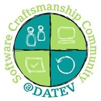
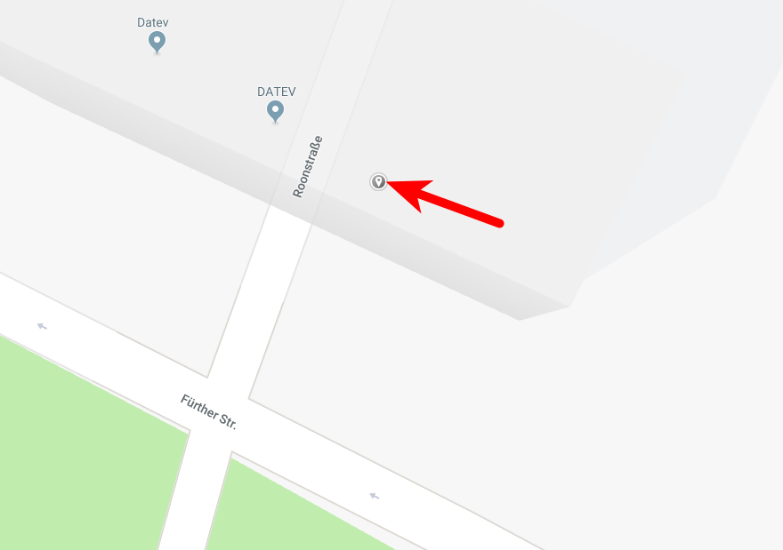
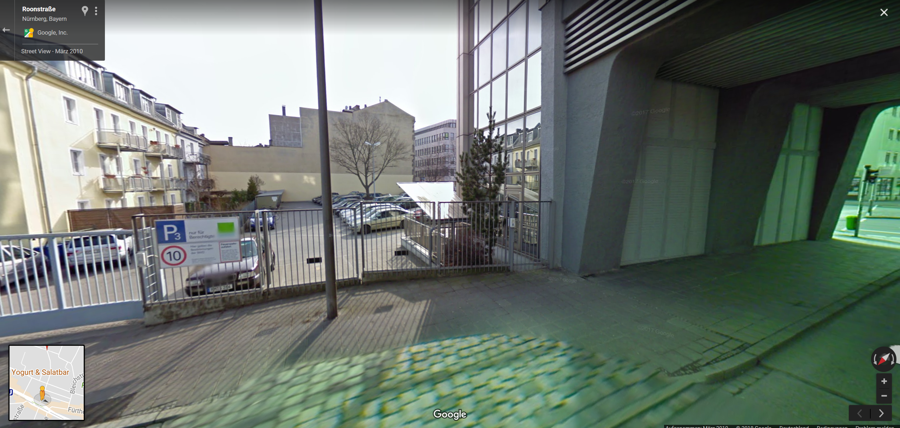

## Hackerkegeln, was ist das?

Hackerkegeln ist ein Meetup, welches von einigen enthusiastischen Leuten aus der 
[Software Craftsmanship Community von der DATEV](http://www.datev.de/scc) organisiert wird. 
Ziel ist es, in einer gemütlichen Atmosphäre DATEV-Interne und -Externe Kollegen miteinander zu vernetzen. 
Gleichzeitig bieten wir einen tollen Raum, um miteinander und voneinander zu lernen!

## Welche Themen behandelt ihr?

Grundsätzlich alles rund um Softwareentwicklung, Craftsmanship, Agile. Je nach Termin 
variieren wir zwischen Formaten wie Mob-Programming, Präsentation, Coding-Dojo, offene Diskussion.
Jeder Teilnehmer ist herzlich eingeladen, einen eigene Session mitzubringen!

Hier einige Beispiele unserer letzten Themen:

* PostgreSQL als NoSQL-DB verwenden
* [Refuctoring](https://twitter.com/codewisdom/status/946483866277163008)
* Software Analytics
* Spieleentwicklung mit Unity
* Angular
* und vieles mehr!

Seit Januar 2018 haben wir angefangen, Session-Ergebnisse 
in unser [GitHub-Repository](https://github.com/Hackerkegeln) hochzuladen.

## Wo und wann findet es statt?

Das Hackerkegeln findet einmal im Monat statt, meistens in der zweiten Woche, zwischen 18:00 und 23:00 Uhr. 
Als Ort haben wir die Kegelbahn der DATEV in der Ecke Fürther Straße / Roonstraße gewählt.

## Was muss ich tun, um dabei zu sein?

Zu aller erst: jeder ist willkommen! Egal ob Software-Entwickler, Tester, Agile Coach
oder anderweitig IT-Interessierter. Wenn du ein inhärentes Interesse hast, Neues zu lernen und dich mit 
Gleichgesinnten zu treffen, bist du herzlich willkommen!

Die Terminorganisation läuft über den Slack-Workspace 
[datev-scc.slack.com](http://datev-scc.slack.com). [Kontaktiere uns](mailto:info@hackerkegeln.de) und wir laden dich in die Channel ein!
Es wäre nett, wenn du dich über Slack ankündigst. Wir haben schließlich nicht unbegrenzt Raum
und wollen keine *Facebook-Party* starten 😉.

Die Teilnahme ist kostenlos (nicht umsonst 😉). Wir besorgen Beamer, Bier, Softdrinks und Pizza. 
Finanziert werden die Meetups von Spenden der Teilnehmer. Wenn dir also das Meetup gefallen hat,
darfst du (aber musst nicht) gerne in unsere Spendenkasse was einwerfen.

## Ich finde euch super!

Freut uns 😉. Dann tweete doch über uns unter [#Hackerkegeln](https://twitter.com/hashtag/Hackerkegeln?src=hash).
